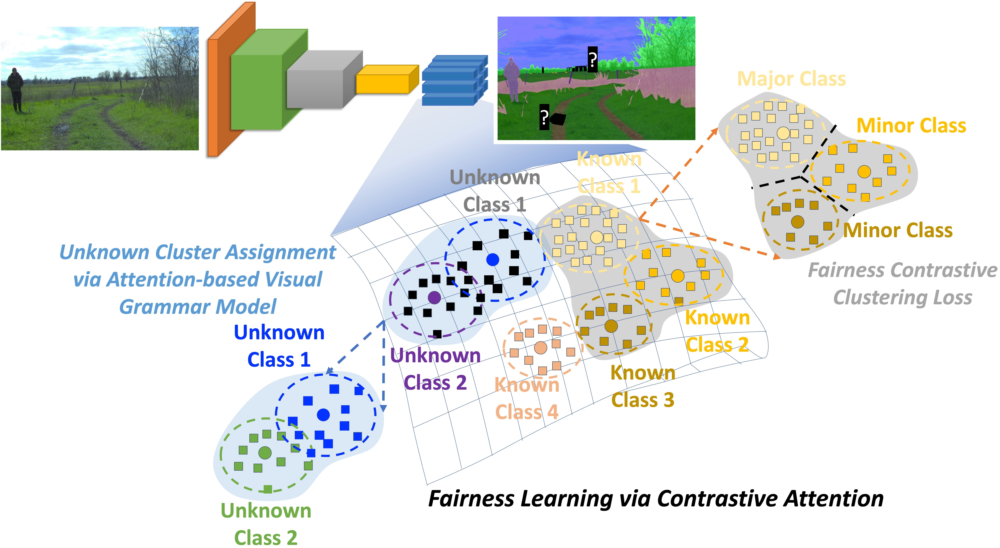

# [CVPR 2025] FALCON: Fairness Learning via Contrastive Attention Approach to Continual Semantic Scene Understanding

> [FALCON: Fairness Learning via Contrastive Attention Approach to Continual Semantic Scene Understanding](https://arxiv.org/abs/2311.15965)<br>
> [Thanh-Dat Truong](https://truongthanhdat.github.io/), [Utsav Prabhu](https://scholar.google.com/citations?user=o9GWp-YAAAAJ&hl=en), [Bhiksha Raj](http://mlsp.cs.cmu.edu/people/bhiksha/), [Jackson Cothren](https://fulbright.uark.edu/departments/geosciences/directory/index/uid/jcothre/name/Jackson+David+Cothren/) and [Khoa Luu](http://csce.uark.edu/~khoaluu)<br>
> University of Arkansas, Computer Vision and Image Understanding Lab, CVIU<br>

	


## Abstract

Continual Learning in semantic scene segmentation aims to continually learn new unseen classes in dynamic               environments while maintaining previously learned knowledge. Prior studies focused on modeling the               catastrophic forgetting and background shift challenges in continual learning. However, fairness, another               major challenge that causes unfair predictions leading to low performance among major and minor classes,               still needs to be well addressed. In addition, prior methods have yet to model the unknown classes well,               thus resulting in producing non-discriminative features among unknown classes. This paper presents a novel               Fairness Learning via Contrastive Attention Approach to continual learning in semantic scene               understanding. In particular, we first introduce a new Fairness Contrastive Clustering loss to address the               problems of catastrophic forgetting and fairness. Then, we propose an attention-based visual grammar               approach to effectively model the background shift problem and unknown classes, producing better feature               representations for different unknown classes. Through our experiments, our proposed approach achieves               State-of-the-Art (SOTA) performance on different continual learning benchmarks, i.e., ADE20K, Cityscapes,               and Pascal VOC. It promotes the fairness of the continual semantic segmentation model.


 

## Code

The implementation of FALCON can be found [here](https://github.com/uark-cviu/FALCON/)

## Citation

If you find this code useful for your research, please consider citing:
```
@inproceedings{truong2023falcon,
    title={FALCON: Fairness Learning via Contrastive Attention Approach to Continual Semantic Scene Understanding},
    author={Truong, Thanh-Dat and Prabhu, Utsav and Raj, Bhiksha and Cothren, Jackson and Luu, Khoa},
    booktitle={The IEEE/CVF Conference on Computer Vision and Pattern Recognition},
    year={2025}
}

```
