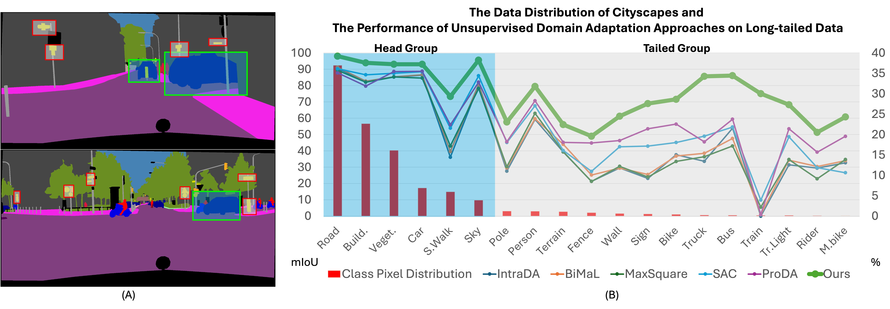

# LONGAN: Long-tailed Learning Approaches to Domain Adaptation, Continual Learning, and Generalization in Semantic Segmentation

	


## Abstract

The research of unsupervised domain adaptation, continual learning, and domain generalization in semantic segmentation               has received considerable attention. However, the long-tailed problem in these three learning tasks has not been               aggressively investigated. Therefore, in this paper, we propose a novel long-tailed learning (LONGAN) framework that can               generalize to unsupervised domain adaptation, continual learning, and domain generalization tasks. First, in order to               address the long-tailed issue caused by imbalanced data, a new metric is introduced to formulate a long-tail learning               framework in the segmentation problem. Then, the metric is further derived into Class Balancing Objective and               Conditional Structure Modeling to address the long-tail problem. Although other segmentation methods work under the               pixel independence assumption, our proposed long-tailed pixel distributions in CoMaL are generally solved in the context               of structural dependency, as that is more realistic. Second, we propose three novel approaches of Bijective Maximum               Likelihood, Prototypical Contrastive Clustering, and Adversarial Style Learning, each is incorporated with our               long-tailed learning framework. These methods then address the long-tailed problems in unsupervised domain adaptation,               continual learning, and domain generalization. Finally, our proposed approach is evaluated on different benchmarks of               unsupervised domain adaptation, continual learning, and domain generalization, and outperforms prior methods by a large               margin in all evaluation protocols.


 

## Preliminary Work 

> [BiMaL: Bijective Maximum Likelihood Approach to Domain Adaptation in Semantic Scene Segmentation](https://arxiv.org/abs/2108.03267)
> ICCV, 2021
> Thanh-Dat Truong, Chi Nhan Duong, Ngan Le, Son Lam Phung, Chase Rainwater, and Khoa Luu


> [Fairness Continual Learning Approach to Semantic Scene Understanding in Open-World Environments](https://arxiv.org/abs/2305.15700)
> NeurIPS, 2024
> Thanh-Dat Truong, Hoang-Quan Nguyen, Bhiksha Raj, and Khoa Luu

## Citation

If you find this code useful for your research, please consider citing:
```
@article{truong2025longan,
    title={LONGAN: Long-tailed Learning Approaches to Domain Adaptation, Continual Learning, and Generalization in Semantic Segmentation},
    author={Thanh-Dat Truong and Huu-Thien Tran and Chi Nhan Duong and Ashley Dowling and Xin Li and Bhiksha Raj and Khoa Luu},
    journal={Under Review of TPAMI},
    year={2025}
}

@inproceedings{truong2021bimal,
  title={Bimal: Bijective maximum likelihood approach to domain adaptation in semantic scene segmentation},
  author={Truong, Thanh-Dat and Duong, Chi Nhan and Le, Ngan and Phung, Son Lam and Rainwater, Chase and Luu, Khoa},
  booktitle={Proceedings of the ieee/cvf international conference on computer vision},
  pages={8548--8557},
  year={2021}
}

@article{truong2023fairness,
  title={Fairness continual learning approach to semantic scene understanding in open-world environments},
  author={Truong, Thanh-Dat and Nguyen, Hoang-Quan and Raj, Bhiksha and Luu, Khoa},
  journal={Advances in Neural Information Processing Systems},
  volume={36},
  pages={65456--65467},
  year={2023}
}

```